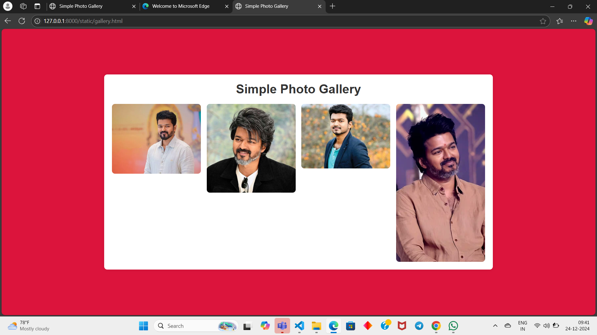

# Ex.08 Design of Interactive Image Gallery
## Date:24-12-2024

## AIM:
To design a web application for an inteactive image gallery with minimum five images.

## DESIGN STEPS:

### Step 1:
Clone the github repository and create Django admin interface.

### Step 2:
Change settings.py file to allow request from all hosts.

### Step 3:
Use CSS for positioning and styling.

### Step 4:
Write JavaScript program for implementing interactivity.

### Step 5:
Validate the HTML and CSS code.

### Step 6:
Publish the website in the given URL.

## PROGRAM :
```
<!DOCTYPE html>
<html lang="en">
<head>
    <meta charset="UTF-8">
    <meta name="viewport" content="width=device-width, initial-scale=1.0">
    <title>Simple Photo Gallery</title>
    <style>
       
        * {
            margin: 0;
            padding: 0;
            box-sizing: border-box;
        }

        
        body {
            font-family: Arial, sans-serif;
            background-color:crimson;
            color: #333;
            display: flex;
            justify-content: center;
            align-items: center;
            height: 100vh;
            text-align: center;
            margin: 0;
        }

        .gallery-container {
            max-width: 1000px;
            width: 100%;
            padding: 20px;
            background-color: #fff;
            box-shadow: 0 0 10px rgba(0, 0, 0, 0.1);
            border-radius: 8px;
        }

        .gallery-title {
            font-size: 32px;
            margin-bottom: 20px;
        }

        .gallery {
            display: grid;
            grid-template-columns: repeat(auto-fill, minmax(200px, 1fr));
            gap: 15px;
            justify-items: center;
        }

        
        .gallery-item {
            border-radius: 8px;
            overflow: hidden;
            cursor: pointer;
            transition: transform 0.3s ease;
        }

        .gallery-item:hover {
            transform: scale(1.05);
        }

        .gallery-image {
            width: 100%;
            height: auto;
            display: block;
            border-radius: 8px;
        }

        
        .modal {
            display: none;
            position: fixed;
            z-index: 1;
            left: 0;
            top: 0;
            width: 100%;
            height: 100%;
            background-color: rgba(0, 0, 0, 0.7);
            justify-content: center;
            align-items: center;
        }

        .modal-content {
            max-width: 90%;
            max-height: 90%;
            margin: auto;
            display: block;
            border-radius: 8px;
        }

        .close {
            position: absolute;
            top: 20px;
            right: 40px;
            font-size: 40px;
            font-weight: bold;
            color: white;
            cursor: pointer;
            z-index: 2;
        }
    </style>
</head>
<body>
    <div class="gallery-container">
        <h1 class="gallery-title">Simple Photo Gallery</h1>
        
        <div class="gallery">
            <div class="gallery-item">
                
            </div>
            <div class="gallery-item">
                
            </div>
            <div class="gallery-item">
                
            </div>
            <div class="gallery-item">
                
            </div>
            
            
        </div>
    </div>

    
    <div id="imageModal" class="modal">
        <span class="close" onclick="closeModal()">&times;</span>
        
    </div>

    <script>
        
        function openModal(imageSrc) {
            document.getElementById("imageModal").style.display = "block";
            document.getElementById("modalImage").src = imageSrc;
        }

        
        function closeModal() {
            document.getElementById("imageModal").style.display = "none";
        }

        
        const galleryImages = document.querySelectorAll('.gallery-image');
        galleryImages.forEach(image => {
            image.addEventListener('click', function() {
                openModal(this.src);
            });
        });

       
        window.onclick = function(event) {
            if (event.target === document.getElementById('imageModal')) {
                closeModal();
            }
        }
    </script>
</body>
</html>
```
## OUTPUT:


## RESULT:
The program for designing an interactive image gallery using HTML, CSS and JavaScript is executed successfully.
